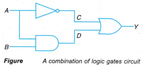
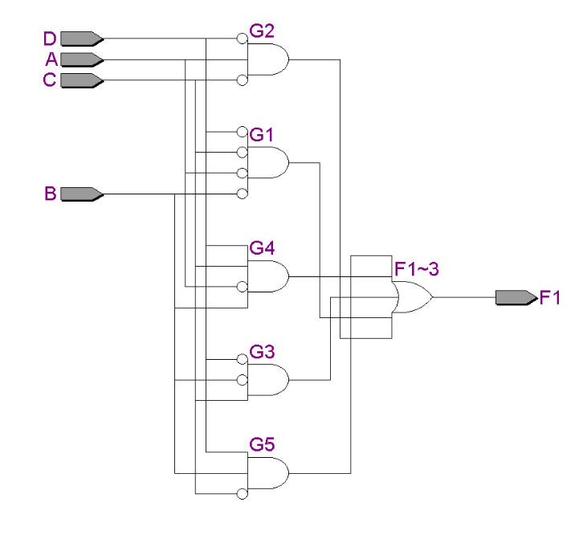
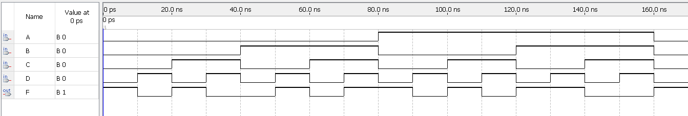
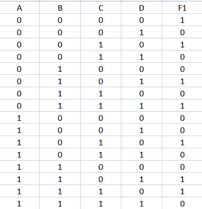
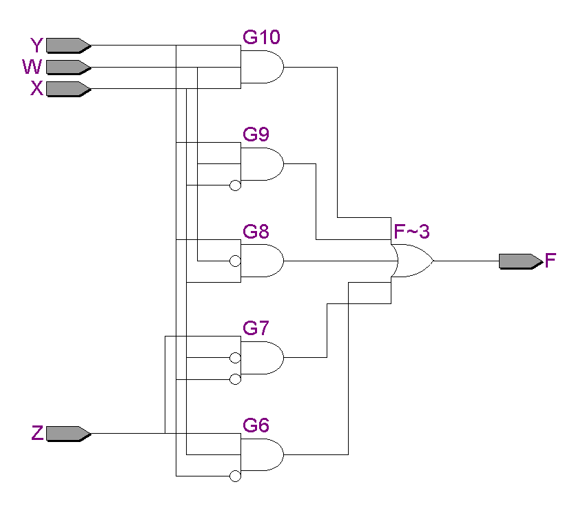
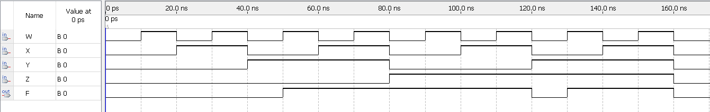
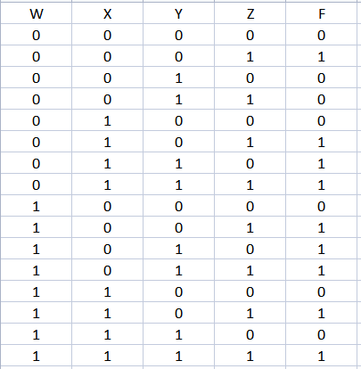

# Experiment--02-Implementation-of-combinational-logic
 
## AIM:
To implement the given logic function verify its operation in Quartus using Verilog programming.
+ F1= A’B’C’D’+AC’D’+B’CD’+A’BCD+BC’D
+ F2=xy’z+x’y’z+w’xy+wx’y+wxy
 
## Equipments Required:
Hardware – PCs, Cyclone II , USB flasher
Software – Quartus prime

## THEORY
* A combinational logic circuit implement logical functions where its outputs depend only on its current combination of input values. On the other hand sequential circuits, unlike combinational logic, have state or memory.
* Some logic operations may require more than one logic gate. Different combinations of gates are designed for different operations. The behaviour of the combined logic gates can be determined by constructing a truth table of the combined gates.
 

## Logic Diagram


## Procedure
1. Create a project with required entities.
2. Create a module along with respective file name.
3. Run the respective programs for the given boolean equations.
4. Run the module and get the respective RTL outputs.
5. Create university program(VWF) for getting timing diagram.
6. Give the respective inputs for timing diagram and obtain the results.

## Program:

Program to implement the given logic function and to verify its operations in quartus
using Verilog programming.
Developed by:NITEESH M 
RegisterNumber:212222230098
```
Program For F1

module combilogic(A,B,C,D,F1);
input A,B,C,D;
output F1;
wire G1,G2,G3,G4,G5;
assign G1=((~A)&(~B)&(~C)&(~D));
assign G2=((A)&(~C)&(~D));
assign G3=((~B)&(C)&(~D));
assign G4=((~A)&(B)&(C)&(D));
assign G5=((B)&(~C)&(D));
assign F1=G1|G2|G3|G4|G5;
endmodule
```
```
Program For F2

module combilogic(W,X,Y,Z,F);
input W,X,Y,Z;
output F;
wire G6,G7,G8,G9,G10;
assign G6=((X)&(~Y)&(Z));
assign G7=((~X)&(~Y)&(Z));
assign G8=((~W)&(X)&(Y));
assign G9=((W)&(~X)&(Y)); 
assign G10=((W)&(X)&(Y));
assign F=G6|G7|G8|G9|G10;
endmodule  
```

## Output:

### First Question (F1= A’B’C’D’+AC’D’+B’CD’+A’BCD+BC’D)

## RTL realization


## Timing Diagram


## TRUTHTABLE


### Second Question (F2=xy’z+x’y’z+w’xy+wx’y+wxy)

## RTL realization


## Timing Diagram


## TRUTHTABLE


## Result:
Thus the given logic functions are implemented using  and their operations are verified using Verilog programming.
